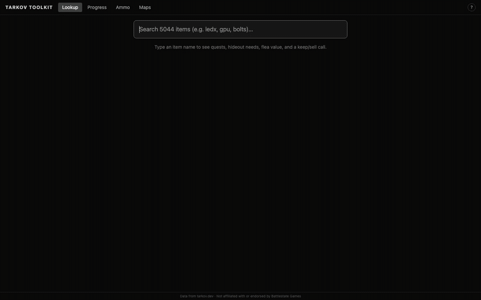

# Tarkov Toolkit

A second-monitor companion for **Escape from Tarkov**. One window, glanceable, keyboard-first —
item lookup, an ammo chart, and interactive maps. Replaces the "ten browser tabs" workflow.

<p align="center">
  
</p>

> **Live:** https://tarkov-toolkit.cloud-flare-061.workers.dev/

It's a static web app that talks directly to the free, public [tarkov.dev](https://tarkov.dev) API —
no backend, no account, no API key. Open the link and use it; optionally **install** it from your
browser for an app window that works offline.

## Features

- **Lookup** — type an item name to see which quests and hideout modules need it, plus flea/vendor
  value and a simple keep-or-sell hint.
- **Progress** — tick off quests and hideout levels (and set your PMC level) so items you no longer
  need drop out of the lookup.
- **Ammo** — sortable penetration / damage chart grouped by caliber, with color-coded armor
  effectiveness.
- **Maps** — pan/zoom maps per location with extract and spawn markers.

## Keyboard

- <kbd>/</kbd> or <kbd>Ctrl</kbd>/<kbd>⌘</kbd>+<kbd>K</kbd> — jump to item search
- <kbd>?</kbd> — open help · <kbd>Esc</kbd> — close

## Your progress is local-only

Quests, hideout levels, and PMC level are stored **only in your browser** (IndexedDB) — there's no
account and nothing is synced. To back it up or move to another device, use **Export** / **Import**
on the Progress tab. Clearing your browser's site data wipes it, so export first if you care about it.

## Develop

```sh
npm install
npm run dev        # http://localhost:5173
npm run build      # production build → dist/
npm run typecheck  # tsc --noEmit
```

## Deploy

Hosted as a Cloudflare **Workers** static-assets site (config in [`wrangler.jsonc`](wrangler.jsonc)).
Connect the repo once in the Cloudflare dashboard with build command `npm run build` and deploy
command `npx wrangler deploy`; after that every push to `main` auto-builds and publishes, and other
branches get preview deployments. Any static host works too — it's just the `dist/` folder.

## Tech

Vite · React + TypeScript · TanStack Query + `graphql-request` · Fuse.js (fuzzy search) ·
Leaflet (maps) · Tailwind CSS · `vite-plugin-pwa`.

## Data & legal

Game data from the [tarkov.dev](https://tarkov.dev) GraphQL API. This is an unofficial fan project,
**not affiliated with or endorsed by Battlestate Games**. Escape from Tarkov is a trademark of
Battlestate Games.
